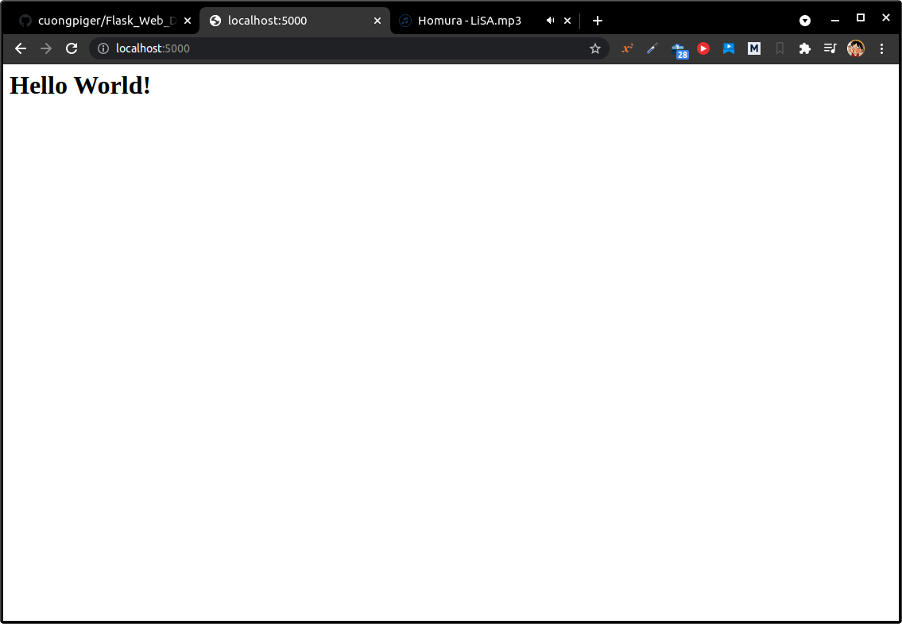
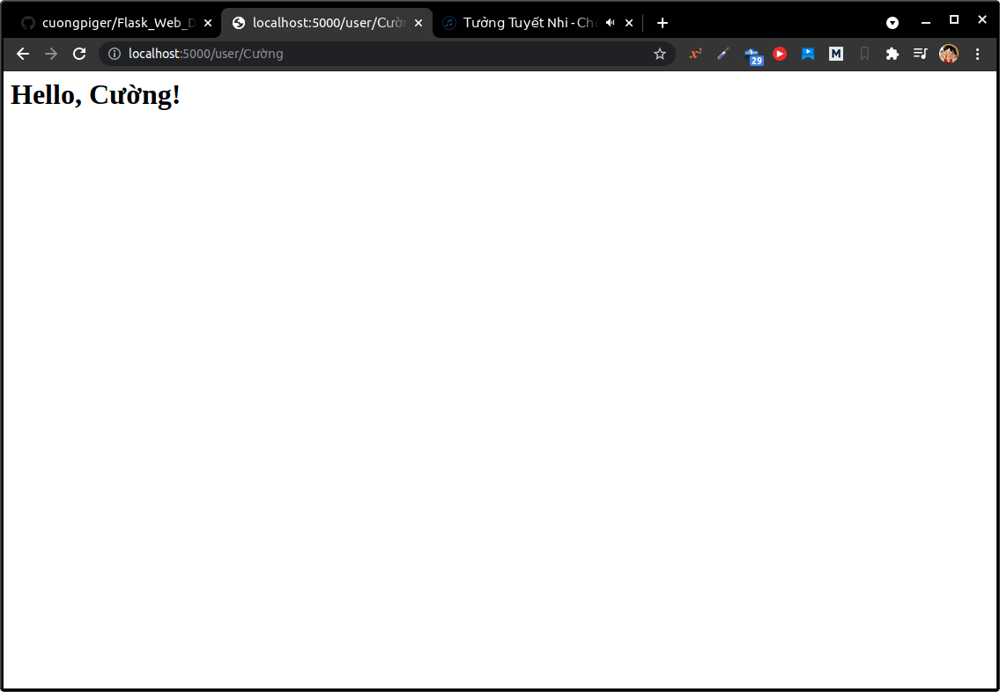
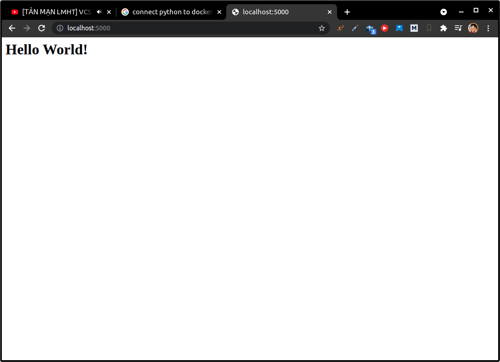
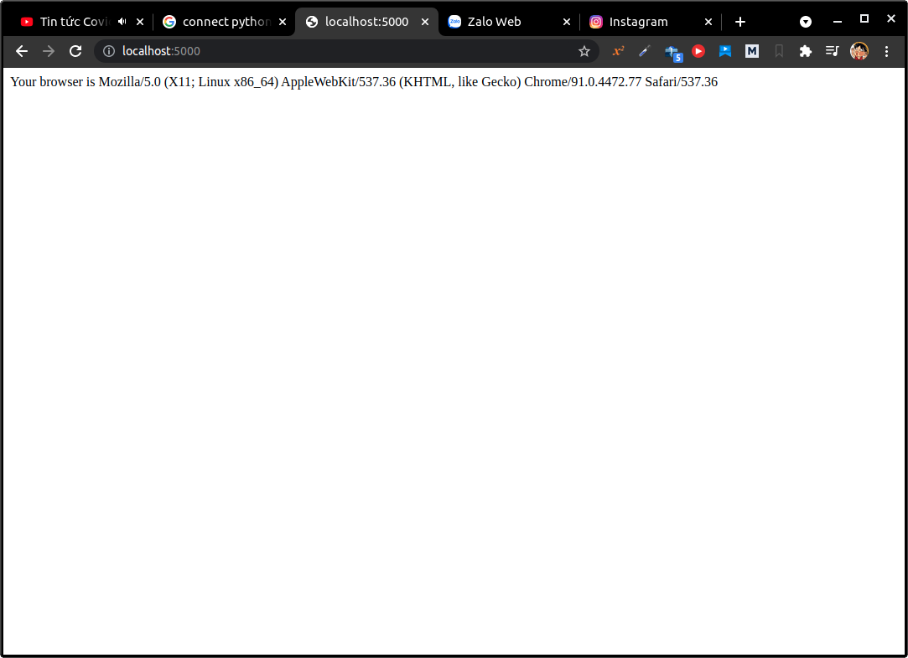

# 1. Initialization
# 2. Routes and View Functions
###### [hello.py](hello.py)
```python
from flask import Flask
app = Flask(__name__)

@app.route("/")
def index():
    return """
        <h1>Hello World!</h1>
    """
```


* Đoạn code dưới đây cũng cho ra kết quả tương tự như đoạn code ở trên:
###### [hello_01.py](hello_01.py)
```python
from flask import Flask
app = Flask(__name__)

def index():
    return """
        <h1>Hello World!</h1>
    """
    
app.add_url_rule("/", "index", index)
```


<hr>

* Đoạn code dưới đây sẽ dựa vào tên của người dùng cung cấp trên url `localhost:5000/user/<name>` để trả về trang HTML chứa nội dụng **Hello, <name>!**.

###### [hello_02.py](hello_02.py)
```python
from flask import Flask
app = Flask(__name__)

@app.route("/user/<name>")
def user(name):
    return """
        <h1>Hello, {}!</h1>
    """.format(name)
```

# 3. A Complete Application
# 4. Development Web Server
* Giả sử cần chạy server trong file `hello.py`, thì tiến hành như sau:
```
export FLASK_APP=hello.py
flask run
```
* Flask mặc định server sẽ chạy tại địa chỉ `localhost:5000`.
# 5. Dynamic Routes
###### [hello_03.py](hello_03.py)
```python
from flask import Flask
app = Flask(__name__)

@app.route("/")
def index():
    return """
        <h1>Hello World!</h1>
    """
    
@app.route("/user/<name>")
def user(name):
    return """
        <h1>Hello, {}!</h1>
    """.format(name)
```



# 6. Debug Mode
* Flask cũng cung cấp cho developer chức năng debug, trong đó hai module rất đáng để chú ý là là **reloader** [tải lại] và **debuger** [debug].
* Khi reloader dc bật, Flask sẽ xem tất cả các source code trong project và sẽ **tự động khởi động lại máy chủ khi có bất kì file code nào dc sửa đổi**.
* Debugger là một công cụ hoạt động trên browser khi ứng dụng có exception xảy ra trong quá trình chạy.
* Mặc định, model debugger sẽ dc tắt, để khởi động nó hãy thực hiện các bước dưới đây:
```
export FLASK_APP=hello.py
export FLASK_DEBUG=1
flask run
```
# 7. Command-Line Options
# 8. The Request-Response Cycle
## 8.1. Application and Request Contexts
###### [hello_04.py](hello_04.py)
```python
from flask import request, Flask
app = Flask(__name__)

@app.route("/")
def index():
    user_agent = request.headers.get("User-Agent")
    return """
        <p>Your browser is {}</p>
    """.format(user_agent)
```


## 8.2. Request Dispatching
## 8.3. The Request Object
## 8.4. Request Hooks
## 8.5. Responses
# 9. Flask Extensions
