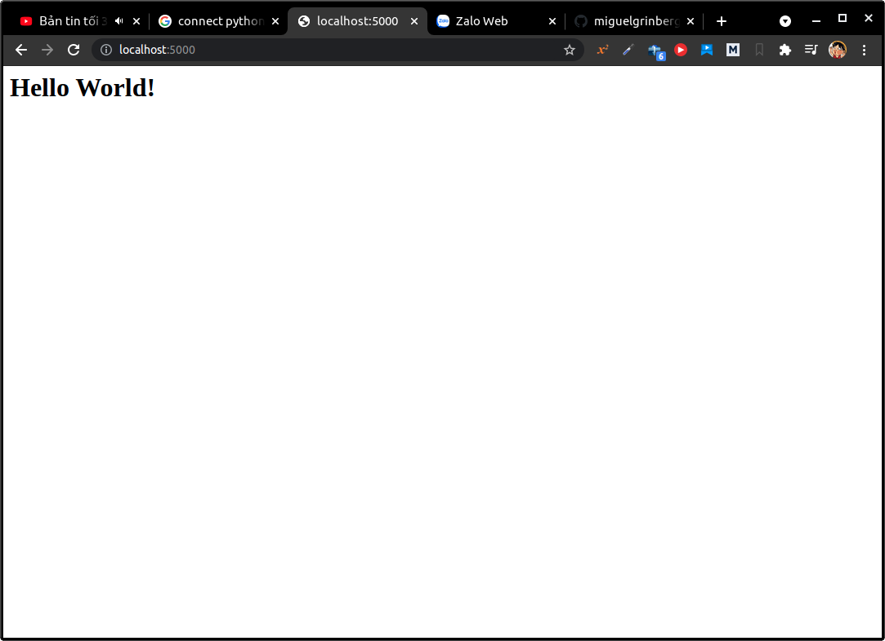
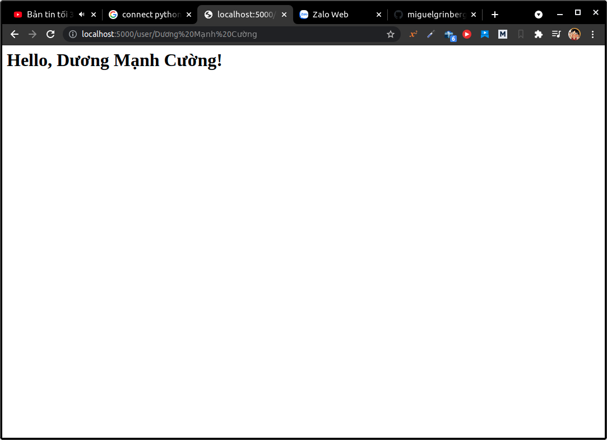
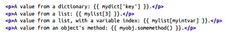
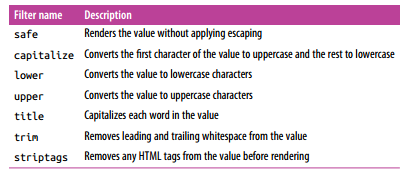

# 1. The Jinja2 Template Engine
###### [templates/index.html](templates/index.html)
```html
<h1>Hello World!</h1>
```
###### [templates/user.html](templates/user.html)
```html
<h1>Hello, {{ name }}!</h1>
```
## 1.1. Rendering Templates
* Cần phải tạo một folder là `templates` và bỏ tất cả các file `html` vào folder này.
###### [demo_03_00.py](demo_03_00.py)
```python
from flask import Flask, render_template
app = Flask(__name__)

@app.route("/")
def index():
    return render_template("index.html")

@app.route("/user/<name>")
def user(name):
    return render_template("user.html", name=name)
```



## 1.2. Variables
<br>


## 1.3. Control Structures
```jinja2

    Hello, {{ user }}!

    Hello, Stranger!

```

<hr>

```jinja2
<ul>
    
        <li>{{ comment }}</li>
    
</ul>
```
<hr>
* Jinja2 cung cấp một chức năng gọi là macros, nó giống như là các hàm trong Python vậy:
```jinja2

    <li>{{ comment }}</li>


<ul>
    
        {{ render_comment(comment) }}
    
</ul>
```

